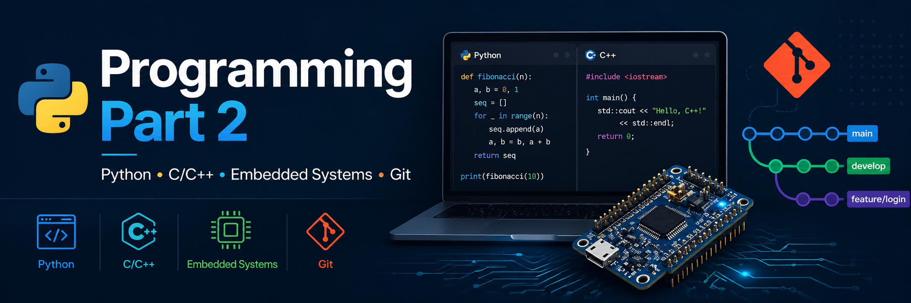

# Programming. Part 2

# programming-part-2-labs-2025-2026
Laboratory works for the course "Programming. Part 2" for the 2025–2026 academic years of NURE. 



## License

This repository is licensed under the MIT License.

The materials and source code presented in this repository are part of the laboratory works for the course **"Programming. Part 2"**, which is conducted at **Kharkiv National University of Radio Electronics (NURE)**.

You are free to use, copy, modify, merge, publish, distribute, sublicense, and/or sell copies of the source code under the terms of the MIT License, provided that the copyright notice and license text are included in all copies or substantial portions of the software.

## Download
To download the laboratory work materials to your computer, clone this repository using Git.

```bash
git clone https://github.com/lab405i/programming-part-2-labs-2025-2026
